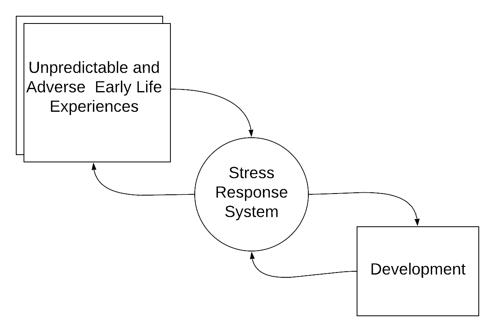
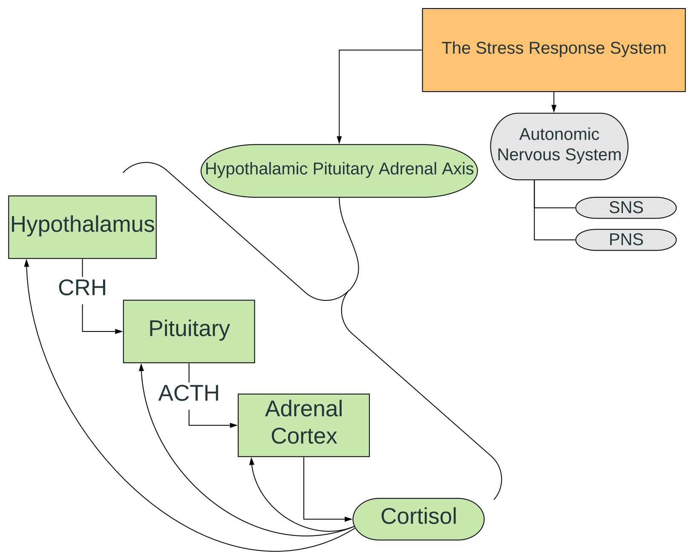
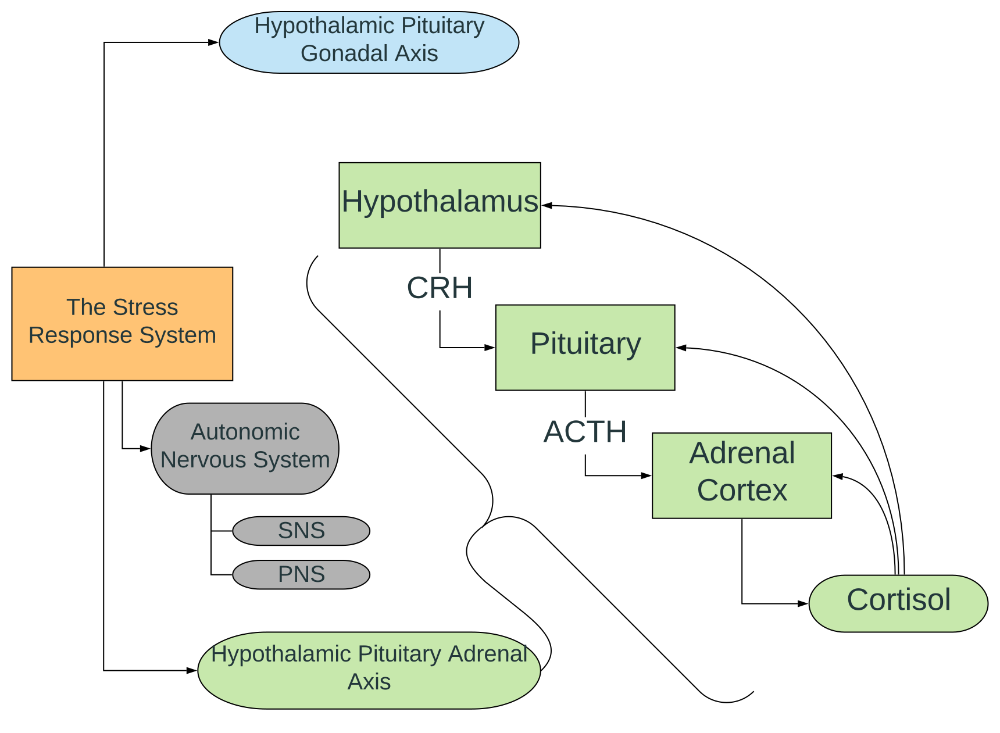

```{r setup, include=FALSE}
options(htmltools.dir.version = FALSE)
```
<!---------slide 1-------->
---
class: center
# Background & Introduction
## Purpose:
"Research on *life history strategy* and the evolutionary importance of *unpredictable and adverse early environments* on *development*."
--
.bottom[
```{r echo = FALSE, out.width = "600px"}

```
]
<!---------slide 2-------->
---
class: center
# Background & Introduction
## Theoretical Approach
--
.center[
```{r echo = FALSE, out.width = "70%"}
knitr::include_graphics("images/ACM.png")
```
]
.left[
  .font60[
Del Giudice, M., Ellis, B. J., & Shirtcliff, E. A. (2011). The Adaptive Calibration Model of stress responsivity. Neurosci. Biobehav. Rev., 35(7), 1562–1592. https://doi.org/10.1016/j.neubiorev.2010.11.007
]
  ]
--
.font80[
*"The central concept of the ACM is that information encoded by the SRS in the course of development feeds back on the long-term calibration of the system itself, resulting in adaptive patterns of responsivity and individual differences in life history-related behavior."*
]
<!---------slide 2B-------->
---
class: center
# Background & Introduction
## Theoretical Approach
.middle[
```{r echo = FALSE, out.width = "100%"}
knitr::include_graphics("images/ACM.png")
```
]
<!---------slide 3-------->
---
class: center
# Background & Introduction
## Components of the Stress Response System
```{r echo = FALSE, out.width = "70%"}
knitr::include_graphics("images/SRS1.svg")
```
<!---------slide 4-------->
---
class: center
# Background & Introduction
## SRS: The HPA Axis
```{r echo = FALSE, out.width = "700px"}

```
<!---------slide 5-------->
---
class: center
# Background & Introduction
## Theoretical Approach
```{r echo = FALSE, out.width = "100%"}
knitr::include_graphics("images/ACM.png")
```
<!---------slide 6-------->
---
class: center
# Background & Introduction
## SRS: Beyond The HPA Axis
```{r echo = FALSE, out.width = "700px"}

```
<!---------slide 7-------->
---
class: center
# Background & Introduction
## SRS: Beyond The HPA Axis
```{r echo = FALSE, out.width = "700px"}
knitr::include_graphics("images/AcrossBetween.svg")
```
<!---------slide 8-------->
---
# Background & Introduction

.pull-left[
  .center[
## What?
 - Type of adversity
]
  ]
.pull-right[
  .center[
## When?
 - Infancy
 - Puberty
]
  ]
  
<!---------slide 9-------->
---
class: center, middle
# Background & Introduction
## SRS: Behavior
```{r echo = FALSE, out.width = "700px"}
knitr::include_graphics("images/profiles.png")
```
<!---------slide 10-------->
---
class: inverse, center, middle
# Empirical Support

<!---------slide 11-------->
---
class: center
# Empirical Support
## Mendota Juvenile Treatment Center
```{r echo = FALSE, out.width = "80%"}
knitr::include_graphics("images/MJTC_base.svg")
```
<!---------slide 12-------->
---
class: center
# Empirical Support
## Mendota Juvenile Treatment Center
```{r echo = FALSE, out.width = "80%"}
knitr::include_graphics("images/MJTC_1.svg")
```
<!---------slide 13-------->
---
class: center
# Empirical Support
## Mendota Juvenile Treatment Center
```{r echo = FALSE, out.width = "80%"}
knitr::include_graphics("images/MJTC_2.svg")
```
<!---------slide END-------->
---

# Thanks!

Slides created via the R package [**xaringan**](https://github.com/yihui/xaringan).

The chakra comes from [remark.js](https://remarkjs.com), [**knitr**](http://yihui.name/knitr), and [R Markdown](https://rmarkdown.rstudio.com).
